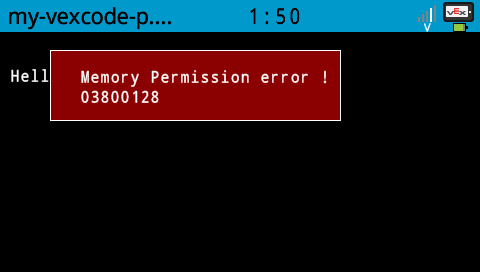
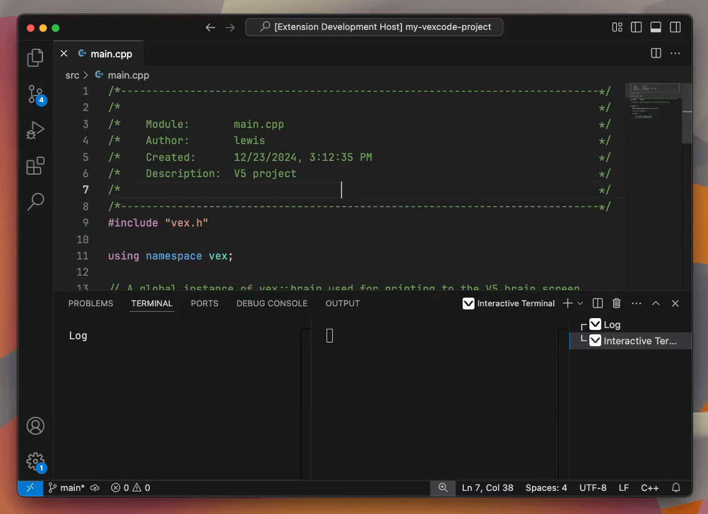
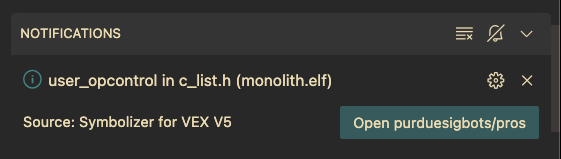

# Symbolizer for VEX V5

A Visual Studio Code extension for VEX V5 robot programmers which reveals the location of a crash, given its address.

It requires little-to-no setup and supports PROS, VEXCode, and vexide.

## Features

### Find where your code is crashing

VEX V5 frameworks such as PROS, VEXCode, and vexide don't give line numbers or file names after a crash; instead, they give an address number. Symbolizer for VEX V5 can turn this number into something more useful by jumping directly to the location of the crash in your source code.

[Learn how](https://github.com/vexide/symbolizer-for-vex-v5/wiki/Find-where-your-code-is-crashing)

### Step through lengthy stack traces

Symbolizer for VEX V5 makes each line of a stack trace clickable so you can easily step through each function that was running during a crash or panic.

[Learn how](https://github.com/vexide/symbolizer-for-vex-v5/wiki/Step-through-a-stack-trace)

### View framework source code

If the address you click is in PROS's source code, Symbolizer for VEX V5 will provide you with a link to the relevant line in PROS's GitHub repository.

For vexide users, Symbolizer for VEX V5 will simply open the relevant file in VS Code.

## Requirements

This extension requires a symbolizer tool in order to function. Installing LLVM or addr2line does the trick, although LLVM may give marginally better results.

The PROS Toolchain includes addr2line, so PROS users do not need to take any further steps.

VEXCode and vexide users will be prompted to install the PROS VS Code extension or to install LLVM.

<!-- ## Extension Settings

Include if your extension adds any VS Code settings through the `contributes.configuration` extension point.

For example:

This extension contributes the following settings:

* `myExtension.enable`: Enable/disable this extension.
* `myExtension.thing`: Set to `blah` to do something. -->

<!-- ## Known Issues

Calling out known issues can help limit users opening duplicate issues against your extension. -->
