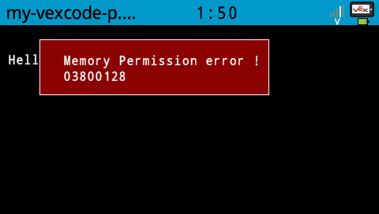
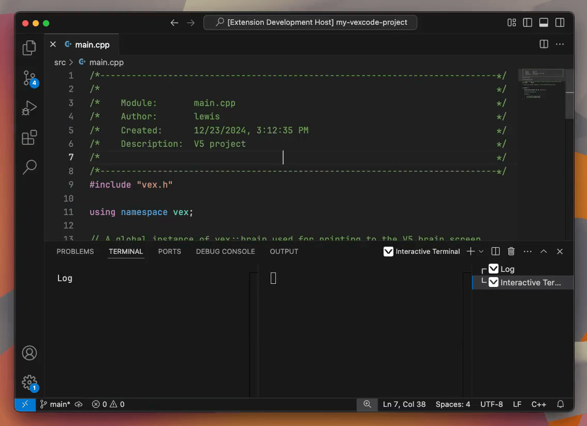
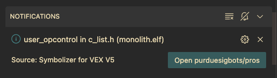

# Symbolizer for VEX V5

A VS Code extension which helps you understand crash reports and find the line of code where your VEX V5 robot program is crashing.

All VEX V5 programming frameworks are supported:

| Feature | vexide | PROS | VEXcode |
|--------:|:------:|:----:|:-------:|
| Find the line of code responsible for a crash | ✅ | ✅ | ✅ |
| Parse stack traces in crash logs | ✅ | ✅ | N/A |
| Zero-configuration setup and usage | ⚠️\[1\] | ✅ | ⛔️\[1\]\[2\]

* \[1\]: Users need to install LLVM, addr2line, or PROS separately.
* \[2\]: Project configuration changes required (auto-fix available).

## Features

### Find where your code is crashing

VEX V5 frameworks such as PROS, VEXcode, and vexide don't give line numbers or file names after a crash; instead, they give an address number. Symbolizer for VEX V5 can turn this number into something more useful by jumping directly to the location of the crash in your source code.

[Learn how](https://github.com/vexide/symbolizer-for-vex-v5/wiki/Find-where-your-code-is-crashing)

### Review confusing debug logs

Symbolizer for VEX V5 makes PROS and vexide debug logs clickable so you can easily view each function that was running during a crash or panic.

[Learn how](https://github.com/vexide/symbolizer-for-vex-v5/wiki/Review-a-debug-log-after-a-crash)

### View framework source code

If the address you click is in PROS's source code, Symbolizer for VEX V5 will provide you with a link to the relevant line in PROS's GitHub repository.

For vexide users, Symbolizer for VEX V5 will simply open the relevant file in VS Code.

## Requirements

This extension requires a symbolizer tool in order to function. Installing LLVM or addr2line does the trick, although LLVM may give marginally better results.

The PROS Toolchain includes addr2line, so PROS users do not need to take any further steps.

VEXcode and vexide users will be prompted to install the PROS VS Code extension or to install LLVM.

<!-- ## Extension Settings

Include if your extension adds any VS Code settings through the `contributes.configuration` extension point.

For example:

This extension contributes the following settings:

* `myExtension.enable`: Enable/disable this extension.
* `myExtension.thing`: Set to `blah` to do something. -->

<!-- ## Known Issues

Calling out known issues can help limit users opening duplicate issues against your extension. -->
